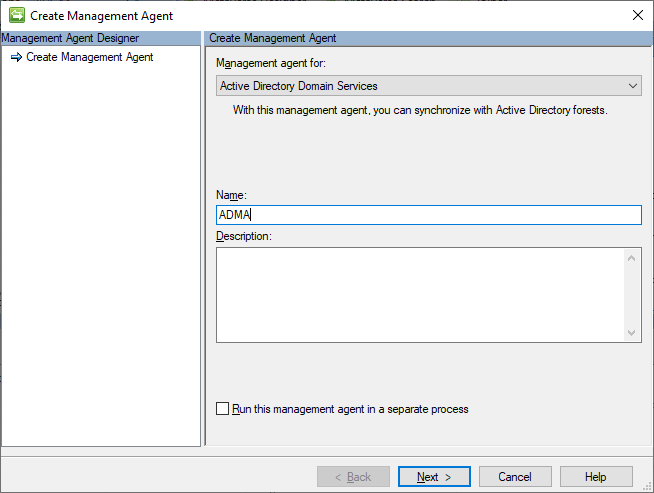
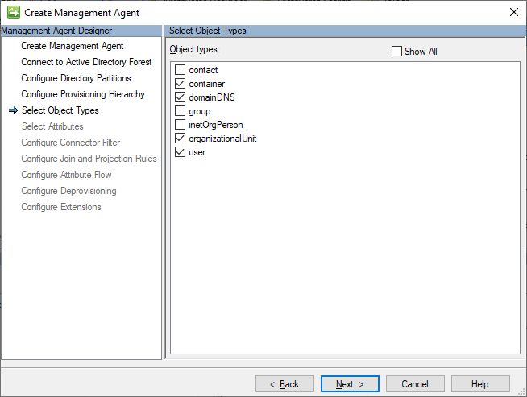
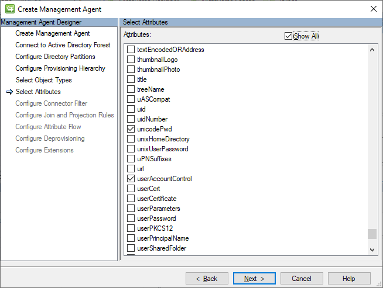
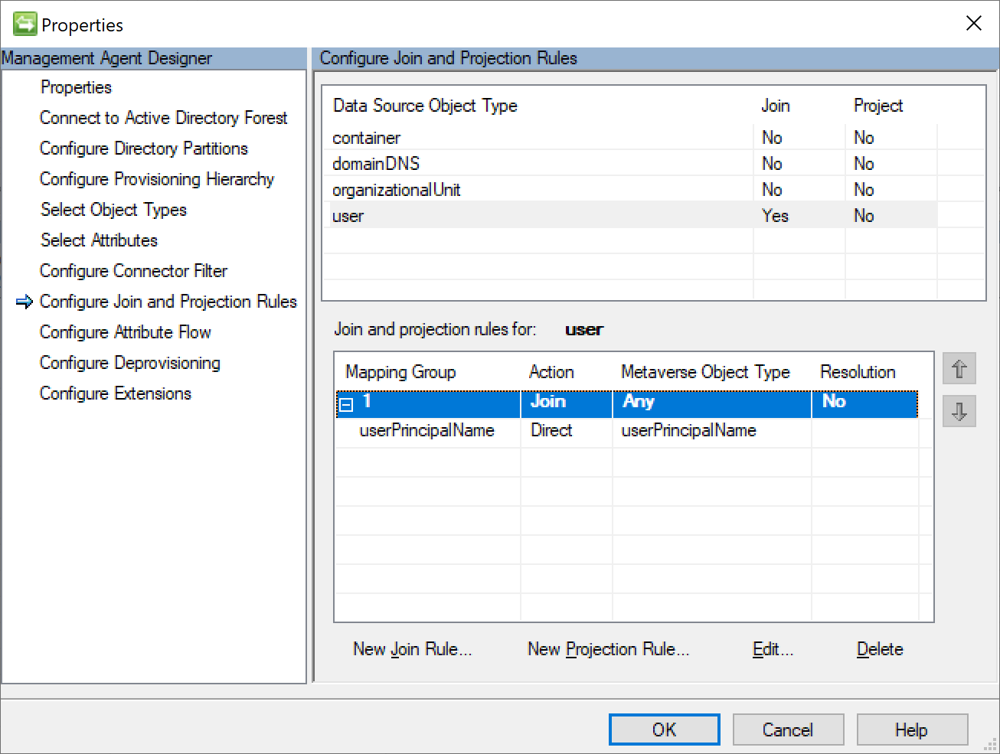
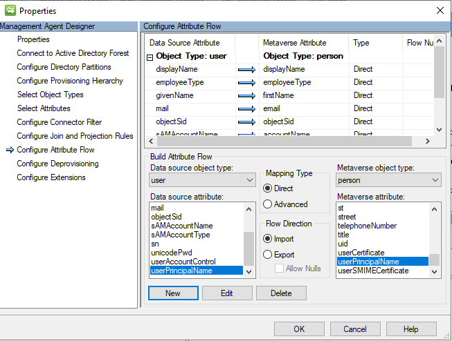
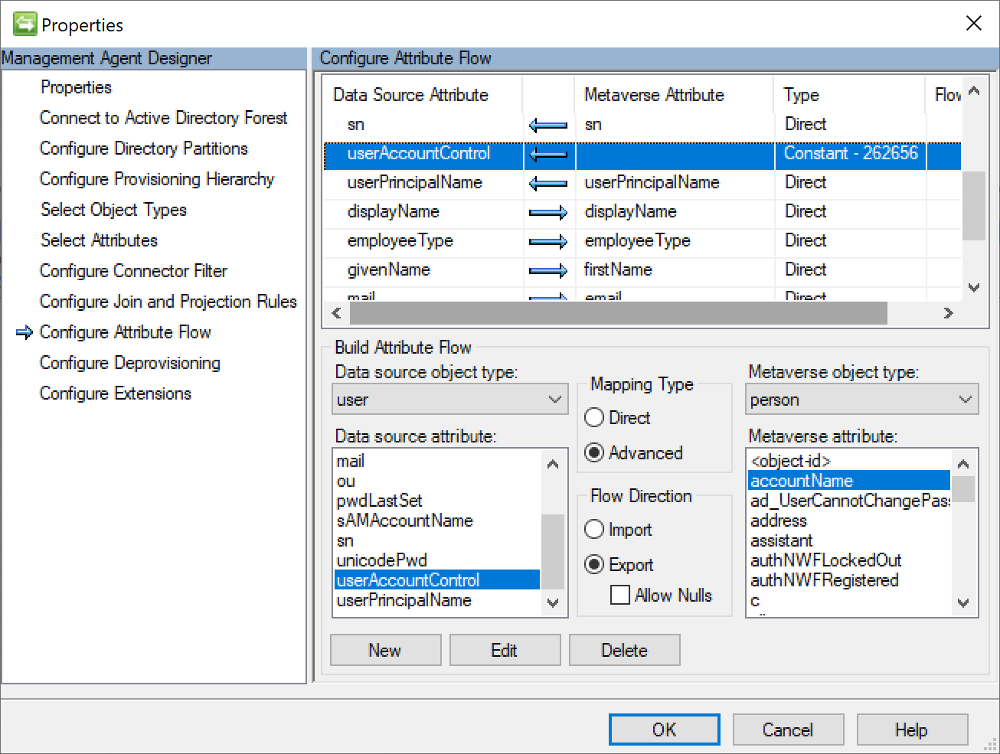

# Setup MIM for AAD Guest Accounts - Active Directory MA with DLL

## Prerequisits
This chapter will install the Active Directory Management Agent to import the AD (user) objects into the metaverse and to create new users in AD and will use the Extension DLL for the advanced attribute flows:

You should have completed the following steps already:

- [Domain setup](preparedomain.md)
- [Windows Server 2019 preparations](prepare-server-ws-2019.md)
- [SQL Server 2016/2017 setup](install-SQL-server.md)
- [MIM Synchronization Service](install-mim-sync-service.md)

> [!NOTE]
> This walkthrough uses sample names and values from a company called Contoso. Replace these with your own. For example:
> - Domain name - **contoso**
> - Password - **Pass@word1**
> - Service Account - **MIMMA**
> - Directory Partitions - **DC=CONTOSO, DC=local**
> - AD Guest OU - **OU=AAD Guest Users**

## Active Directory MA

The Active Directory management agent is a connector for AD Domain Services. To create this connector, you use the Create Management Agent wizard.
1. To open the Create Management Agent wizard, on the Actions menu, click Create.
2. On the _Create Management Agent_ page, provide the following settings, and then click **Next**:
> - Management agent for: **Active Directory Domain Services**
> - Name: **ADMA**

3. On the _Connect to Active Directory Forest_ page, provide the following settings, and then click **Next**:
> - Forest name: **contoso.local**
> - User name: **MIMMA**
> - Password : `<the MIMMA password>`
> - Domain: **Contoso**
4. On the _Configure Directory Partitions_ page, provide the following settings, and then click **Next**:
> - In the _Select Directory Partitions_ list, select `<DC=CONTOSO, DC=local>`
> - To open the _Select Containers_ dialog box, click **Containers**
> - Select only the `<AAD Guest Users>` container
> - To close the Select Containers dialog box, click **OK**

5. On the _Configure Provisioning Hierarchy_ page, click **Next**
6. On the _Select Object Types_ page, provide the following settings, and then click **Next**:
> - Container
> - domainDNS
> - organizationalUnit
> - user

7. On the _Select Attributes_ page, check **Show All**, select the following attributes, and then click **Next**:
> - displayName
> - employeeType
> - givenName
> - mail
> - ou
> - pwdLastSet
> - sAMAccountName
> - sn
> - unicodePwd
> - userAccountControl
> - userPrincipalName

8. On the _Configure Connector Filter_ page, click **Next**
9. On the _Configure Join and Projection Rules_ page, click **New Join Rule**
> - For the Data Source Attribute, select **userPrincipalName**
> - For the metaverse object type, select **Person**
> - For the metaverse attribute select **userPrincipalName**
> - For the mapping type select **Direct**
> - On the pop-up, select **OK**

10.	Click **OK** and click **Next** to go to the attribute flow page
11.	On the _Attribute flow_ page, create the following flows:
> - For the Data Source Object Type select **User**
> - For the mapping type select **Direct**
> - For the metaverse object type select **Person**
> - Create the following mappings:

> |Data source attribute | Flow Direction | Metaverse attribute |Allow null |
> |-------------------|:------------------|---------------------|-----------:
> |displayName | Import| displayname|  |
> |employeeType | Import | employeetype | |
> |givenName | Import | firstname |  |
> |Mail| Import | Email |  |
> |sAMAccountName | Import | accountname  | |
> |Sn | Import | lastname |  |
> |userPrincipalName | Import | userPrincipalName | |
> |displayName | Export | displayname | Allow |
> |employeeType | Export | employeetype |
> |givenName | Export | firstname | Allow |
> |Mail | Export | Email | Allow |
> |sn | Export | lastname | Allow |
> |userPrincipalName | Export | userPrincipalName |

12.	A static value will also be required for the userAccountControl for this: 
> - Select Object Type: **user** in the top column
> - Select **user** as the _data source object type_ in the build attribute flow
> - Select **userAccountControl** as the _Data source attribute_
> - Select **Advanced** as the _mapping type_
> - Select **Export** as the _Direction_
> - Set the _Metaverse object type_ to **person**
> - Select **Street** as the _Metaverse Attribute_
> - Click **New**
> - In the pop-up, select the **Constant** check box
> - Type **262656**
> - Click **OK** to close

13.	Click **Next** to go to the _Deprovisioning_ page, keep the defaults (**Make them disconnectors**) and click **Next**
14.	On the **Configure Extensions** page, leave the defaults and click **Finish**

## Next: Installing Management Agents - Graph API MA
In total, 2 Management Agents will be installed:
- [The Graph API MA with DLL](installing-GraphAPIMA-dll.md) – to read the Guest account details in Azure AD

> - [The Active Directory MA with DLL](installing-ADMA-dll-version.md) – to create / manage the B2B accounts in the Active Directory Domain
